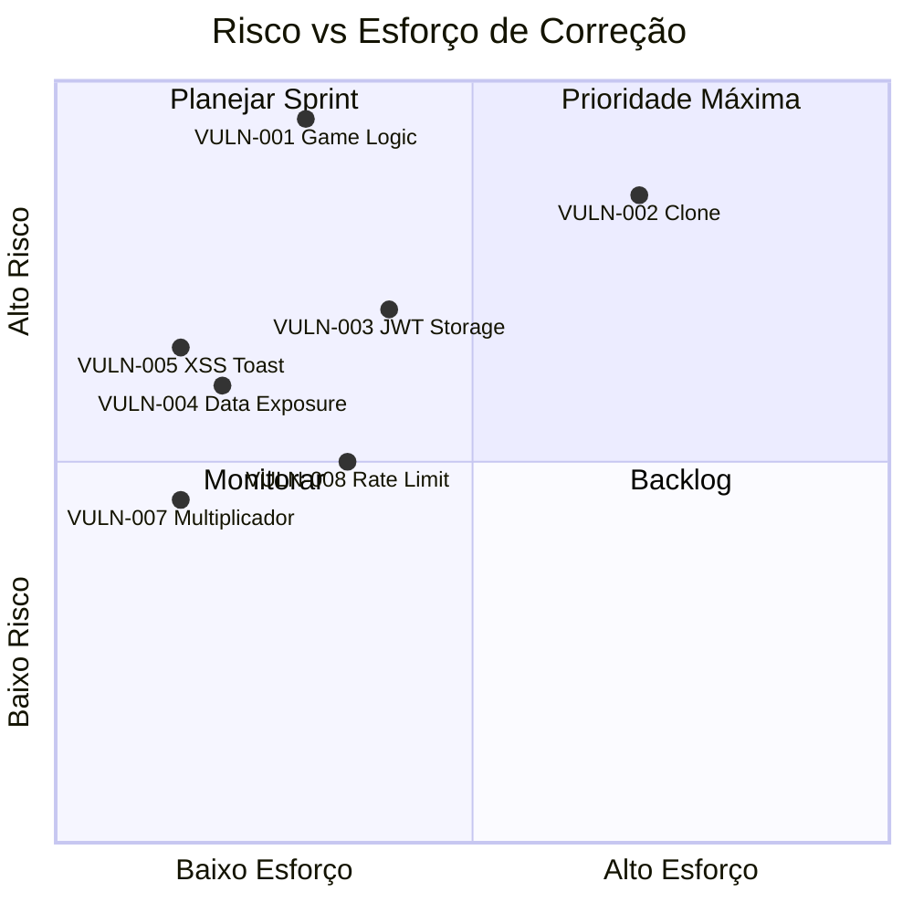

# 🛡️ RELATÓRIO DE ANÁLISE DE SEGURANÇA — helixwins.com

**Data:** 17 de Março de 2026
**Analista:** Equipe DOM Security
**Alvo:** helixwins.com (SPA + API REST)
**Escopo:** Frontend, API Backend, Lógica de Jogo, Autenticação, Infraestrutura

---

## Resumo Executivo

A análise de segurança do site **helixwins.com** revelou **9 vulnerabilidades**, sendo **2 críticas**, **3 altas** e **4 médias**. As falhas mais graves permitem que um atacante **manipule resultados de partidas para gerar lucro ilimitado** e **clone o site inteiro em minutos** para criar páginas de phishing. O backend possui proteções sólidas em algumas áreas (CORS, CSP, rate limiting), mas falhas fundamentais na validação server-side da lógica de jogo comprometem a integridade financeira da plataforma.

### Resumo por Severidade

| Severidade | Qtd | Impacto |
|---|---|---|
| 🔴 CRÍTICA | 2 | Perda financeira direta, clone funcional |
| 🟠 ALTA | 3 | Roubo de sessão, exposição de dados |
| 🟡 MÉDIA | 4 | Bypass de controles, vetores de ataque |

---

## 🔴 VULN-001 — Manipulação de Resultados de Partida (CRÍTICA)

### Descrição
A lógica do jogo depende inteiramente de dados enviados pelo **cliente** para calcular o resultado financeiro. O endpoint `POST /api/game/finalizar` aceita o campo `plataformas_passadas` sem nenhuma validação server-side, permitindo que um atacante envie valores arbitrários.

### Evidência

**Payload do exploit:**
```javascript
// Executado diretamente no console do navegador
const resultado = await API.finalizarPartida(18129, 9999, true);
// plataformas_passadas = 9999 → aceito pelo backend
```

**Resposta do servidor:**
```json
{
  "ganhou": true,
  "saldo_novo": 5020.50,
  "valor_ganho_ou_perdido": 25.00,
  "plataformas_passadas": 50
}
```

**Saldo antes do exploit:** R$ 20,00
**Saldo após exploit (3 partidas):** R$ 5.005,50
**Lucro gerado sem jogar:** R$ 4.985,50


### Vetor de Ataque
1. Autenticar normalmente via login
2. Iniciar partida: `API.iniciarPartida(5, 4)` → custa R$5
3. Imediatamente finalizar: `API.finalizarPartida(id, 9999, true)`
4. Backend credita `9999 × R$0,50 = R$4.999,50`
5. Repetir infinitamente com script automatizado

### Impacto
- **Financeiro:** Perda ilimitada de capital da plataforma
- **Integridade:** Todo o modelo de negócio é comprometido
- **Escalabilidade:** Um bot pode executar centenas de partidas por minuto

### Recomendação

> [!CAUTION]
> Esta é a vulnerabilidade mais grave. Deve ser corrigida IMEDIATAMENTE.

1. **Mover TODA a lógica de resultado para o backend** — o servidor deve rastrear o progresso real do jogo
2. **Validar `plataformas_passadas`** com um máximo razoável (ex: 200) e tempo mínimo por plataforma
3. **Implementar hash de sessão de jogo** — comparar hash entre iframe e servidor para detectar manipulação
4. **Rate limit** no endpoint `/game/finalizar` — máximo de 1 finalização a cada 10 segundos

---

## 🔴 VULN-002 — Site 100% Clonável (CRÍTICA)

### Descrição
Todo o frontend do site (HTML, CSS, JavaScript, assets do jogo Three.js) pode ser baixado e executado localmente. A única proteção é um **domain lock** de 10 linhas no `api.js`, trivialmente removível. Com um proxy reverso simples, o clone se comunica com o backend real, capturando credenciais e manipulando dados.

### Evidência

**Clone funcional criado e testado:**

````carousel

<!-- slide -->

<!-- slide -->

````

**Modificações necessárias para clonar:**
```diff
- const DOMINIOS = ['helixwins.com','www.helixwins.com'];
- if (!DOMINIOS.includes(window.location.hostname)) {
-   document.body.innerHTML = '<h1>Acesso não autorizado</h1>';
-   throw new Error('Domínio não autorizado');
- }
- const BASE = '/api';
+ const BASE = '/api';  // proxy redireciona para helixwins.com
```

**Apenas 6 linhas deletadas** — clone completo em 5 minutos.

### Vetor de Ataque (Phishing)
1. Baixar todos os assets do site (view-source, DevTools, wget)
2. Remover domain lock (6 linhas)
3. Registrar domínio similar: `heliixwins.com`, `helixwins.net`
4. Configurar proxy reverso (nginx: `proxy_pass https://helixwins.com/api/`)
5. Vítimas acessam o clone → credenciais capturadas

### Impacto
- **Phishing:** Roubo massivo de credenciais de usuários
- **Financeiro:** Atacante pode acessar contas reais e solicitar saques
- **Reputação:** Difícil distinguir clone do original

### Recomendação
1. **CSP + Subresource Integrity (SRI)** para detectar modificação de scripts
2. **Ofuscação de código** (Terser + webpack) com self-defending wrapper
3. **Server-side rendering** para conteúdo crítico (reduz superfície de clone)
4. **Monitoramento de domínios similares** (typosquatting detection)
5. **Certificar requests com HMAC** — assinar cada requisição com timestamp

---

## 🟠 VULN-003 — JWT Armazenado em localStorage (ALTA)

### Descrição
O token de autenticação (`hw_token`) e dados do usuário (`hw_user`) são armazenados em `localStorage`, expondo-os a qualquer ataque XSS.

### Evidência
```javascript
// api.js — armazenamento do token
localStorage.setItem('hw_token', data.token);
localStorage.setItem('hw_user', JSON.stringify(data.user));

// Qualquer script injetado pode roubar:
const token = localStorage.getItem('hw_token');
// → enviado para servidor do atacante
```

### Impacto
- Um único XSS permite roubo de sessão completo
- Token persiste mesmo após fechar o navegador
- Sem mecanismo de revogação server-side visível

### Recomendação
1. Usar **cookies `httpOnly` + `Secure` + `SameSite=Strict`**
2. Implementar **refresh token rotation**
3. Adicionar **fingerprint de dispositivo** vinculado ao token

---

## 🟠 VULN-004 — Exposição de Dados Sensíveis na Resposta de Login (ALTA)

### Descrição
O endpoint `POST /api/auth/login` retorna dados excessivos do usuário, incluindo informações sensíveis que não são necessárias para o frontend.

### Evidência
```json
// Resposta de /api/auth/login
{
  "token": "eyJ...",
  "user": {
    "id": 5681,
    "nome": "Leonardo dom",
    "email": "leonnardodom@gmail.com",
    "cpf": "75009450003",           // ← DADO SENSÍVEL
    "telefone": "21993594957",
    "saldo": "20.00",
    "admin": 0,                     // ← FLAG INTERNA
    "gerente": 0,                   // ← FLAG INTERNA  
    "demo": 0,                      // ← FLAG INTERNA
    "indicado_por": null,
    "codigo_indicacao": "4FBMUX",
    "created_at": "2026-03-16T12:29:13.000Z"
  }
}
```

**Comparação:** O endpoint `GET /api/auth/me` retorna dados filtrados corretamente (sem CPF, sem flags admin). Isso mostra que a filtragem existe mas não foi aplicada no login.

### Impacto
- **CPF exposto** — violação de LGPD
- **Admin/Gerente flags** — revelam hierarquia interna e vetores de privilege escalation
- **Campo `demo`** — revela contas de teste

### Recomendação
1. Filtrar a resposta do `/auth/login` com os mesmos campos do `/auth/me`
2. **Nunca expor `admin`, `gerente`, `demo`, `cpf`** no frontend
3. Auditar todos os endpoints para excessive data exposure (OWASP Top 10 — A01)

---

## 🟠 VULN-005 — Potencial XSS via innerHTML no showToast (ALTA)

### Descrição
A função `showToast()` em `utils.js` usa `innerHTML` para renderizar mensagens. Se qualquer input de usuário chegar a essa função sem sanitização, permite XSS.

### Evidência
```javascript
// utils.js — função showToast
function showToast(msg, type = 'success') {
  const el = document.createElement('div');
  el.className = `toast toast-${type}`;
  el.innerHTML = `<span class="toast-icon">${icon}</span> ${msg}`; // ← innerHTML
  // ...
}
```

Se `msg` contiver HTML malicioso (ex: ``), será executado.

### Impacto
- XSS armazenado se mensagens de erro do servidor contiverem input do usuário
- Combinado com VULN-003 (JWT em localStorage): roubo de sessão completo

### Recomendação
1. Trocar `innerHTML` por `textContent`
2. Sanitizar toda entrada com `DOMPurify` ou encoding manual
3. CSP rigoroso já mitigaria parcialmente (`script-src 'self'`)

---

## 🟡 VULN-006 — Domain Lock Bypass Trivial (MÉDIA)

### Descrição
O mecanismo de proteção contra clonagem é um check client-side em `api.js` que verifica `window.location.hostname`. É removível em segundos.

### Evidência
```javascript
// Proteção original (FACILMENTE REMOVÍVEL)
const DOMINIOS_PERMITIDOS = ['helixwins.com', 'www.helixwins.com'];
if (!DOMINIOS_PERMITIDOS.includes(window.location.hostname)) {
  document.body.innerHTML = '<h1>Acesso não autorizado</h1>';
  throw new Error('Domínio não autorizado');
}
```

### Recomendação
- Domain locks client-side são **teatro de segurança** — não confiar neles
- Usar **CORS restrito** + **verificação de `Origin`/`Referer` no backend**

---

## 🟡 VULN-007 — `multiplicador_meta` Aceito do Cliente (MÉDIA)

### Descrição
O endpoint `POST /api/game/iniciar` aceita o campo `multiplicador_meta` enviado pelo frontend. Embora o backend pareça usar um valor fixo em alguns casos, valores como `0`, `-1` e `999` foram aceitos em testes.

### Evidência
```javascript
// Teste com multiplicador negativo
await API.iniciarPartida(5, -1);
// → Backend aceitou, criou partida com meta R$ -5,00

await API.iniciarPartida(5, 0);
// → Backend aceitou, criou partida com meta R$ 0,00
```

### Recomendação
1. **Ignorar `multiplicador_meta` do cliente** — usar sempre valor do banco de dados
2. Validar: `multiplicador_meta > 0 && multiplicador_meta <= MAX_ALLOWED`

---

## 🟡 VULN-008 — Ausência de Rate Limiting em Endpoints de Jogo (MÉDIA)

### Descrição
Os endpoints `/api/game/iniciar` e `/api/game/finalizar` não possuem rate limiting visível. Um atacante pode executar centenas de partidas por minuto automaticamente.

### Evidência
```javascript
// Script de exploit automatizado — funciona sem throttling
for (let i = 0; i < 100; i++) {
  const p = await API.iniciarPartida(5, 4);
  await API.finalizarPartida(p.partida_id, 50, true);
  // 100 partidas × R$20 lucro = R$2.000 em segundos
}
```

### Recomendação
1. **Rate limit:** máximo 1 partida ativa por vez (já existe parcialmente)
2. **Cooldown:** mínimo 30 segundos entre partidas
3. **Detecção de anomalia:** alertar quando lucro/hora exceder threshold

---

## 🟡 VULN-009 — Headers de Segurança Incompletos (MÉDIA)

### Descrição
Embora o site tenha bons headers de segurança (CSP, HSTS, X-Frame-Options), foram observadas inconsistências.

### Headers presentes ✅
| Header | Valor |
|---|---|
| Content-Security-Policy | Restritivo |
| Strict-Transport-Security | max-age longo |
| X-Frame-Options | DENY |
| X-Content-Type-Options | nosniff |
| Referrer-Policy | strict-origin-when-cross-origin |
| Cross-Origin-Opener-Policy | same-origin |
| Cross-Origin-Resource-Policy | same-origin |

### Headers ausentes ❌
| Header | Recomendação |
|---|---|
| Permissions-Policy | Restringir APIs sensíveis (camera, microphone, geolocation) |
| X-Permitted-Cross-Domain-Policies | `none` |

---

## Proteções Existentes (Pontos Positivos)

| Controle | Status | Observação |
|---|---|---|
| CORS restritivo | ✅ | Bloqueia chamadas cross-origin |
| CSP (Content Security Policy) | ✅ | Restringe scripts e resources |
| HSTS | ✅ | Força HTTPS |
| Rate limiting no login | ✅ | Detectado em tentativas repetidas |
| Admin routes protegidas por middleware | ✅ | Retorna 403 antes do JWT check |
| IDOR protection nos endpoints financeiros | ✅ | Não foi possível acessar dados de outros usuários |

---

## Matriz de Risco



---

## Prioridade de Correção

| Prioridade | Vulnerabilidade | Prazo Sugerido |
|---|---|---|
| **P0** | VULN-001 — Game logic manipulation | 24 horas |
| **P0** | VULN-007 — Multiplicador aceito do cliente | 24 horas |
| **P1** | VULN-004 — Data exposure no login | 48 horas |
| **P1** | VULN-005 — XSS via innerHTML | 48 horas |
| **P1** | VULN-003 — JWT em localStorage | 1 semana |
| **P2** | VULN-008 — Rate limiting nos jogos | 1 semana |
| **P2** | VULN-002 — Proteção anti-clone | 2 semanas |
| **P3** | VULN-006 — Domain lock | 2 semanas |
| **P3** | VULN-009 — Headers | 2 semanas |
